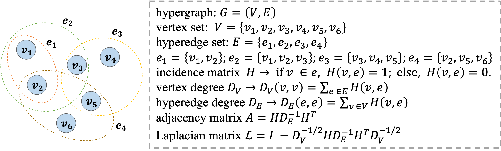
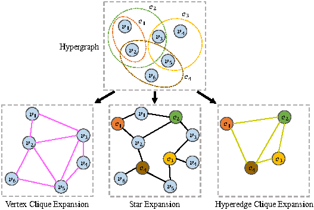

# Hypergraph Survey
-  Hypergraph Learning: Methods and Practices
(**TPAMI, 2022**) [[paper](https://ieeexplore.ieee.org/document/9264674)]
-  More Recent Advances in (Hyper)Graph Partitioning
(**ACM Computing Surveys, 2022**) [[paper](https://dl.acm.org/doi/10.1145/3571808)]
-  A Survey on Hypergraph Representation Learning
(**ACM Computing Surveys, 2023**) [[paper](https://dl.acm.org/doi/abs/10.1145/3605776)]

# Hypergraph Learning

## Conference Papers

### International Conference on Machine Learning
-  Exact Inference in High-order Structured Prediction
(**ICML, 2023**) [[paper](https://openreview.net/forum?id=VaDX94whmE)]
-  From Hypergraph Energy Functions to Hypergraph Neural Networks
(**ICML, 2023**) [[paper](https://openreview.net/forum?id=a032h8Jb9I)]
-  Optimal LP Rounding and Linear-Time Approximation Algorithms for Clustering Edge-Colored Hypergraphs
(**ICML, 2023**) [[paper](https://openreview.net/forum?id=eZK32L3Pl2)]
-  Projected Tensor Power Method for Hypergraph Community Recovery
(**ICML, 2023**) [[paper](https://openreview.net/forum?id=CcDKqUR546)]
-  Nonlinear Feature Diffusion on Hypergraphs
(**ICML, 2022**) [[paper](https://proceedings.mlr.press/v162/prokopchik22a.html)]
-  Two Heads are Better Than One: Hypergraph-Enhanced Graph Reasoning for Visual Event Ratiocination
(**ICML, 2021**) [[paper](https://proceedings.mlr.press/v139/zheng21b.html)]
-  Random Walks on Hypergraphs with Edge-Dependent Vertex Weights
(**ICML, 2019**) [[paper](https://proceedings.mlr.press/v97/chitra19a.html)]
-  Molecular Hypergraph Grammar with Its Application to Molecular Optimization
(**ICML, 2019**) [[paper](https://proceedings.mlr.press/v97/kajino19a.html)]
-  Submodular Hypergraphs: p-Laplacians, Cheeger Inequalities and Spectral Clustering
(**ICML, 2018**) [[paper](https://proceedings.mlr.press/v80/li18e.html)]
-  Re-revisiting Learning on Hypergraphs: Confidence Interval and Subgradient Method
(**ICML, 2017**) [[paper](https://proceedings.mlr.press/v70/zhang17d.html)]

### Annual Conference on Neural Information Processing Systems
-  SHINE: SubHypergraph Inductive Neural nEtwork
(**NeurIPS, 2022**) [[paper](https://openreview.net/forum?id=IsHRUzXPqhI)]
-  Sparse Hypergraph Community Detection Thresholds in Stochastic Block Model
(**NeurIPS, 2022**) [[paper](https://openreview.net/forum?id=MjaROj4BOwk)]
-  Augmentations in Hypergraph Contrastive Learning: Fabricated and Generative
(**NeurIPS, 2022**) [[paper](https://openreview.net/forum?id=igMc_C9pgYG)]
-  Hypergraph Propagation and Community Selection for Objects Retrieval
(**NeurIPS, 2021**) [[paper](https://proceedings.neurips.cc/paper/2021/hash/1da546f25222c1ee710cf7e2f7a3ff0c-Abstract.html)]
-  Transformers Generalize DeepSets and Can be Extended to Graphs & Hypergraphs
(**NeurIPS, 2021**) [[paper](https://proceedings.neurips.cc/paper/2021/hash/ec0f40c389aeef789ce03eb814facc6c-Abstract.html)]
-  Finding Bipartite Components in Hypergraphs
(**NeurIPS, 2021**) [[paper](https://proceedings.neurips.cc/paper/2021/hash/41bacf567aefc61b3076c74d8925128f-Abstract.html)]
-  Edge Representation Learning with Hypergraphs
(**NeurIPS, 2021**) [[paper](https://proceedings.neurips.cc/paper/2021/hash/3def184ad8f4755ff269862ea77393dd-Abstract.html)]
-  Neural Message Passing for Multi-Relational Ordered and Recursive Hypergraphs
(**NeurIPS, 2020**) [[paper](https://proceedings.neurips.cc/paper/2020/hash/217eedd1ba8c592db97d0dbe54c7adfc-Abstract.html)]
-  HyperGCN: A New Method For Training Graph Convolutional Networks on Hypergraphs
(**NeurIPS, 2019**) [[paper](https://papers.nips.cc/paper/2019/hash/1efa39bcaec6f3900149160693694536-Abstract.html)]
-  Inhomogeneous Hypergraph Clustering with Applications
(**NeurIPS, 2017**) [[paper](https://proceedings.neurips.cc/paper/2017/hash/a50abba8132a77191791390c3eb19fe7-Abstract.html)]

### International Conference on Learning Representations
-  Equivariant Hypergraph Diffusion Neural Operators
(**ICLR, 2023**) [[paper](https://openreview.net/forum?id=RiTjKoscnNd)]
-  Ollivier-Ricci Curvature for Hypergraphs: A Unified Framework
(**ICLR, 2023**) [[paper](https://openreview.net/forum?id=sPCKNl5qDps)]
-  You are AllSet: A Multiset Function Framework for Hypergraph Neural Networks 
(**ICLR, 2022**) [[paper](https://openreview.net/forum?id=hpBTIv2uy_E)]
-  Learning to Represent Action Values as a Hypergraph on the Action Vertices
(**ICLR, 2021**) [[paper](https://openreview.net/forum?id=Xv_s64FiXTv)]
-  Hyper-SAGNN: a self-attention based graph neural network for hypergraphs
(**ICLR, 2020**) [[paper](https://openreview.net/forum?id=ryeHuJBtPH)]

### ACM Knowledge Discovery and Data Mining
-  Learning Causal Effects on Hypergraphs
(**KDD Best Paper, 2022**) [[paper](https://dl.acm.org/doi/10.1145/3534678.3539299)]
-  Core-periphery Models for Hypergraphs
(**KDD, 2022**) [[paper](https://dl.acm.org/doi/10.1145/3534678.3539272)]
-  Self-Supervised Hypergraph Transformer for Recommender Systems
(**KDD, 2022**) [[paper](https://dl.acm.org/doi/10.1145/3534678.3539473)]
-  Multi-Behavior Hypergraph-Enhanced Transformer for Sequential Recommendation
(**KDD, 2022**) [[paper](https://dl.acm.org/doi/10.1145/3534678.3539342)]
-  Generalizable Floorplanner through Corner Block List Representation and Hypergraph Embedding
(**KDD, 2022**) [[paper](https://dl.acm.org/doi/10.1145/3534678.3539220)]
-  H2MN: Graph Similarity Learning with Hierarchical Hypergraph Matching Networks
(**KDD, 2021**) [[paper](https://dl.acm.org/doi/10.1145/3447548.3467328)]
-  Structural Patterns and Generative Models of Real-world Hypergraphs
(**KDD, 2020**) [[paper](https://dl.acm.org/doi/10.1145/3394486.3403060)]
-  Minimizing Localized Ratio Cut Objectives in Hypergraphs
(**KDD, 2020**) [[paper](https://dl.acm.org/doi/10.1145/3394486.3403222)]
-  Parameterized Correlation Clustering in Hypergraphs and Bipartite Graphs
(**KDD, 2020**) [[paper](https://dl.acm.org/doi/10.1145/3394486.3403238)]
-  Hypergraph Clustering Based on PageRank
(**KDD, 2020**) [[paper](https://dl.acm.org/doi/10.1145/3394486.3403248)]
-  Dual Channel Hypergraph Collaborative Filtering
(**KDD, 2020**) [[paper](https://dl.acm.org/doi/10.1145/3394486.3403253)]
-  Hypergraph Convolutional Recurrent Neural Network
(**KDD, 2020**) [[paper](https://dl.acm.org/doi/10.1145/3394486.3403389)]
-  E-tail Product Return Prediction via Hypergraph-based Local Graph Cut
(**KDD, 2018**) [[paper](https://dl.acm.org/doi/10.1145/3219819.3219829)]

### International Conference on Research on Development in Information Retrieval
-  Spatio-Temporal Hypergraph Learning for Next POI Recommendation
(**SIGIR, 2023**) [[paper](https://dl.acm.org/doi/10.1145/3539618.3591770)]
-  Multi-view Hypergraph Contrastive Policy Learning for Conversational Recommendation
(**SIGIR, 2023**) [[paper](https://dl.acm.org/doi/10.1145/3539618.3591737)]
-  Next Basket Recommendation with Intent-aware Hypergraph Adversarial Network
(**SIGIR, 2023**) [[paper](https://dl.acm.org/doi/10.1145/3539618.3591742)]
-  HyperFormer: Learning Expressive Sparse Feature Representations via Hypergraph Transformer
(**SIGIR, 2023**) [[paper](https://dl.acm.org/doi/10.1145/3539618.3591999)]
-  Co-clustering Interactions via Attentive Hypergraph Neural Network
(**SIGIR, 2022**) [[paper](https://dl.acm.org/doi/10.1145/3477495.3531868)]
-  Hypergraph Contrastive Collaborative Filtering
(**SIGIR, 2022**) [[paper](https://dl.acm.org/doi/10.1145/3477495.3532058)]
-  Enhancing Hypergraph Neural Networks with Intent Disentanglement for Session-based Recommendation
(**SIGIR, 2022**) [[paper](https://dl.acm.org/doi/10.1145/3477495.3531794)]
-  DH-HGCN: Dual Homogeneity Hypergraph Convolutional Network for Multiple Social Recommendations
(**SIGIR, 2022**) [[paper](https://dl.acm.org/doi/10.1145/3477495.3531828)]
-  Communication Efficient Distributed Hypergraph Clustering
(**SIGIR, 2021**) [[paper](https://dl.acm.org/doi/10.1145/3404835.3463092)]
-  Next-item Recommendation with Sequential Hypergraphs
(**SIGIR, 2020**) [[paper](https://dl.acm.org/doi/10.1145/3397271.3401133)]

### International World Wide Web Conferences
-  HyConvE: A Novel Embedding Model for Knowledge Hypergraph Link Prediction with Convolutional Neural Networks
(**WWW, 2023**) [[paper](https://dl.acm.org/doi/10.1145/3543507.3583256)]
-  Intra and Inter Domain HyperGraph Convolutional Network for Cross-Domain Recommendation
(**WWW, 2023**) [[paper](https://dl.acm.org/doi/10.1145/3543507.3583402)]
-  Cut-matching Games for Generalized Hypergraph Ratio Cuts
(**WWW, 2023**) [[paper](https://dl.acm.org/doi/10.1145/3543507.3583539)]
-  Correlative Preference Transfer with Hierarchical Hypergraph Network for Multi-Domain Recommendation
(**WWW, 2023**) [[paper](https://dl.acm.org/doi/10.1145/3543507.3583331)]
-  IHGNN: Interactive Hypergraph Neural Network for Personalized Product Search
(**WWW, 2022**) [[paper](https://dl.acm.org/doi/10.1145/3485447.3511954)]
-  MiDaS: Representative Sampling from Real-world Hypergraphs
(**WWW, 2022**) [[paper](https://dl.acm.org/doi/10.1145/3485447.3512157)]
-  Strongly Local Hypergraph Diffusions for Clustering and Semi-supervised Learning
(**WWW, 2021**) [[paper](https://dl.acm.org/doi/10.1145/3442381.3449887)]
-  Multiplex Bipartite Network Embedding using Dual Hypergraph Convolutional Networks
(**WWW, 2021**) [[paper](https://dl.acm.org/doi/10.1145/3442381.3449954)]
-  Self-Supervised Multi-Channel Hypergraph Convolutional Network for Social Recommendation
(**WWW, 2021**) [[paper](https://dl.acm.org/doi/10.1145/3442381.3449844)]
-  How Do Hyperedges Overlap in Real-World Hypergraphs? - Patterns, Measures, and Generators
(**WWW, 2021**) [[paper](https://dl.acm.org/doi/10.1145/3442381.3450010)]
-  How Much and When Do We Need Higher-order Information in Hypergraphs? A Case Study on Hyperedge Prediction
(**WWW, 2020**) [[paper](https://dl.acm.org/doi/10.1145/3366423.3380016)]
-  Clustering in graphs and hypergraphs with categorical edge labels
(**WWW, 2020**) [[paper](https://dl.acm.org/doi/10.1145/3366423.3380152)]
-  Revisiting User Mobility and Social Relationships in LBSNs: A Hypergraph Embedding Approach
(**WWW, 2019**) [[paper](https://dl.acm.org/doi/10.1145/3308558.3313635)]
-  Learning on Partial-Order Hypergraphs
(**WWW, 2018**) [[paper](https://dl.acm.org/doi/10.1145/3178876.3186064)]

### Artificial Intelligence and Statistics
-  Hypergraph Simultaneous Generators 
(**AISTATS, 2022**) [[paper](https://proceedings.mlr.press/v151/pedrood22a.html)]
-  Statistical and computational thresholds for the planted k-densest sub-hypergraph problem
(**AISTATS, 2022**) [[paper](https://proceedings.mlr.press/v151/corinzia22a.html)]
-  $𝐻𝑆^2$: Active learning over hypergraphs with pointwise and pairwise queries
(**AISTATS, 2019**) [[paper](https://proceedings.mlr.press/v89/chien19a.html)]
-  Community Detection in Hypergraphs: Optimal Statistical Limit and Efficient Algorithms
(**AISTATS, 2018**) [[paper](https://proceedings.mlr.press/v84/chien18a.html)]
-  Submodularity on Hypergraphs: From Sets to Sequences
(**AISTATS, 2018**) [[paper](https://proceedings.mlr.press/v84/mitrovic18a.html)]

### AAAI Conference on Artificial Intelligence
-  Hypergraph Modeling via Spectral Embedding Connection: Hypergraph Cut, Weighted Kernel k-Means, and Heat Kernel 
(**AAAI, 2022**) [[paper](https://ojs.aaai.org/index.php/AAAI/article/view/20787)]
-  MS-HGAT: Memory-Enhanced Sequential Hypergraph Attention Network for Information Diffusion Prediction
(**AAAI, 2022**) [[paper](https://ojs.aaai.org/index.php/AAAI/article/view/20334)]
-  Adaptive Hypergraph Neural Network for Multi-Person Pose Estimation
(**AAAI, 2022**) [[paper](https://ojs.aaai.org/index.php/AAAI/article/view/20201)]
-  Compound Word Transformer: Learning to Compose Full-Song Music over Dynamic Directed Hypergraphs
(**AAAI, 2021**) [[paper](https://ojs.aaai.org/index.php/AAAI/article/view/16091)]
-  Stock Selection via Spatiotemporal Hypergraph Attention Network: A Learning to Rank Approach
(**AAAI, 2021**) [[paper](https://ojs.aaai.org/index.php/AAAI/article/view/16127)]
-  Self-Supervised Hypergraph Convolutional Networks for Session-based Recommendation
(**AAAI, 2021**) [[paper](https://ojs.aaai.org/index.php/AAAI/article/view/16578)]
-  The Impact of Selfishness in Hypergraph Hedonic Games 
(**AAAI, 2020**) [[paper](https://ojs.aaai.org/index.php/AAAI/article/view/5542)]
-  Hypergraph Label Propagation Network 
(**AAAI, 2020**) [[paper](https://ojs.aaai.org/index.php/AAAI/article/view/6170)]
-  Wasserstein Soft Label Propagation on Hypergraphs: Algorithm and Generalization Error Bounds
(**AAAI, 2019**) [[paper](https://ojs.aaai.org/index.php/AAAI/article/view/4244)]
-  Fast Relational Probabilistic Inference and Learning: Approximate Counting via Hypergraphs
(**AAAI, 2019**) [[paper](https://ojs.aaai.org/index.php/AAAI/article/view/4779)]
-  Hypergraph Optimization for Multi-Structural Geometric Model Fitting
(**AAAI, 2019**) [[paper](https://ojs.aaai.org/index.php/AAAI/article/view/4897)]
-  Learning Non-Uniform Hypergraph for Multi-Object Tracking
(**AAAI, 2019**) [[paper](https://ojs.aaai.org/index.php/AAAI/article/view/4928)]
-  Hypergraph Neural Networks
(**AAAI, 2019**) [[paper](https://ojs.aaai.org/index.php/AAAI/article/view/4235)]
-  Hypergraph p-Laplacian: A Differential Geometry View 
(**AAAI, 2018**) [[paper](https://ojs.aaai.org/index.php/AAAI/article/view/11823)]
-  Hypergraph Learning With Cost Interval Optimization 
(**AAAI, 2018**) [[paper](https://ojs.aaai.org/index.php/AAAI/article/view/11761)]

### International Joint Conference on Artificial Intelligence
-  Hypertron: Explicit Social-Temporal Hypergraph Framework for Multi-Agent Forecasting
(**IJCAI, 2022**) [[paper](https://www.ijcai.org/proceedings/2022/189)]
-  Hypergraph Structure Learning for Hypergraph Neural Networks
(**IJCAI, 2022**) [[paper](https://www.ijcai.org/proceedings/2022/267)]
-  Online ECG Emotion Recognition for Unknown Subjects via Hypergraph-Based Transfer Learning
(**IJCAI, 2022**) [[paper](https://www.ijcai.org/proceedings/2022/509)]
-  Spatial-Temporal Sequential Hypergraph Network for Crime Prediction with Dynamic Multiplex Relation Learning
(**IJCAI, 2021**) [[paper](https://www.ijcai.org/proceedings/2021/225)]
-  UniGNN: a Unified Framework for Graph and Hypergraph Neural Networks
(**IJCAI, 2021**) [[paper](https://www.ijcai.org/proceedings/2021/353)]
-  Semi-Dynamic Hypergraph Neural Network for 3D Pose Estimation
(**IJCAI, 2020**) [[paper](https://www.ijcai.org/proceedings/2020/109)]
-  Knowledge Hypergraphs: Prediction Beyond Binary Relations
(**IJCAI, 2020**) [[paper](https://www.ijcai.org/proceedings/2020/303)]
-  Two-Phase Hypergraph Based Reasoning with Dynamic Relations for Multi-Hop KBQA
(**IJCAI, 2020**) [[paper](https://www.ijcai.org/proceedings/2020/500)]
-  Dynamic Hypergraph Neural Networks
(**IJCAI, 2019**) [[paper](https://www.ijcai.org/proceedings/2019/366)]
-  Hypergraph Induced Convolutional Manifold Networks
(**IJCAI, 2019**) [[paper](https://www.ijcai.org/proceedings/2019/371)]
-  Dynamic Hypergraph Structure Learning
(**IJCAI, 2018**) [[paper](https://www.ijcai.org/proceedings/2018/439)]
-  Synchronisation Games on Hypergraphs
(**IJCAI, 2017**) [[paper](https://www.ijcai.org/proceedings/2017/57)]
-  Vertex-Weighted Hypergraph Learning for Multi-View Object Classification
(**IJCAI, 2017**) [[paper](https://www.ijcai.org/proceedings/2017/387)]
-  Adaptive Hypergraph Learning for Unsupervised Feature Selection
(**IJCAI, 2017**) [[paper](https://www.ijcai.org/Proceedings/2017/501)]
-  Lossy Compression of Pattern Databases Using Acyclic Random Hypergraphs
(**IJCAI, 2017**) [[paper](https://www.ijcai.org/proceedings/2017/611)]

### ACM International Conference on Information and Knowledge Management
-  Semi-supervised Hypergraph Node Classification on Hypergraph Line Expansion
(**CIKM, 2022**) [[paper](https://dl.acm.org/doi/10.1145/3511808.3557447)]
-  Click-Through Rate Prediction with Multi-Modal Hypergraphs
(**CIKM, 2021**) [[paper](https://dl.acm.org/doi/10.1145/3459637.3482327)]
-  Double-Scale Self-Supervised Hypergraph Learning for Group Recommendation
(**CIKM, 2021**) [[paper](https://dl.acm.org/doi/abs/10.1145/3459637.3482426)]
-  Hyperbolic Hypergraphs for Sequential Recommendation
(**CIKM, 2021**) [[paper](https://dl.acm.org/doi/10.1145/3459637.3482351)]
-  HyperGraph Convolution Based Attributed HyperGraph Clustering
(**CIKM, 2021**) [[paper](https://dl.acm.org/doi/10.1145/3459637.3482437)]
-  Hypergraph Random Walks, Laplacians, and Clustering
(**CIKM, 2020**) [[paper](https://dl.acm.org/doi/10.1145/3340531.3412034)]
-  NHP: Neural Hypergraph Link Prediction
(**CIKM, 2020**) [[paper](https://dl.acm.org/doi/10.1145/3340531.3411870)]
-  Modeling Multi-way Relations with Hypergraph Embedding
(**CIKM, 2018**) [[paper](https://dl.acm.org/doi/10.1145/3269206.3269274)]
-  Computing Betweenness Centrality in B-hypergraphs
(**CIKM, 2017**) [[paper](https://dl.acm.org/doi/10.1145/3132847.3133093)]
-  Maintaining Densest Subsets Efficiently in Evolving Hypergraphs
(**CIKM, 2017**) [[paper](https://dl.acm.org/doi/abs/10.1145/3132847.3132907)]

### International Conference on Data Mining
-  Hypergraph Convolutional Network for Group Recommendation
(**ICDM, 2021**) [[paper](https://ieeexplore.ieee.org/document/9679118)]
-  THyMe+: Temporal Hypergraph Motifs and Fast Algorithms for Exact Counting
(**ICDM, 2021**) [[paper](https://ieeexplore.ieee.org/document/9679171)]
-  Hypergraph Ego-networks and Their Temporal Evolution
(**ICDM, 2021**) [[paper](https://ieeexplore.ieee.org/document/9679078)]
-  HyperTeNet: Hypergraph and Transformer-based Neural Network for Personalized List Continuation
(**ICDM, 2021**) [[paper](https://ieeexplore.ieee.org/document/9679065)]
-  Spatiotemporal Hypergraph Convolution Network for Stock Movement Forecasting
(**ICDM, 2020**) [[paper](https://ieeexplore.ieee.org/document/9338303)]
-  Evolution of Real-World Hypergraphs: Patterns and Models without Oracles
(**ICDM, 2020**) [[paper](https://ieeexplore.ieee.org/document/9338313)]

## Journal Papers

### IEEE Transactions on Pattern Analysis and Machine Intelligence
-  Hypergraph Learning: Methods and Practices
(**TPAMI, 2022**) [[paper](https://ieeexplore.ieee.org/document/9264674)]
-  HGNN+: General Hypergraph Neural Networks
(**TPAMI, 2022**) [[paper](https://ieeexplore.ieee.org/document/9795251)]
-  Heterogeneous Hypergraph Variational Autoencoder for Link Prediction
(**TPAMI, 2022**) [[paper](https://ieeexplore.ieee.org/document/9354594)]
-  Hypergraph Collaborative Network on Vertices and Hyperedges
(**TPAMI, 2022**) [[paper](https://ieeexplore.ieee.org/document/9782536)]
-  Generating Hypergraph-Based High-Order Representations of Whole-Slide Histopathological Images for Survival Prediction
(**TPAMI, 2022**) [[paper](https://ieeexplore.ieee.org/document/9903546)]
-  Neural Graph Matching Network: Learning Lawler’s Quadratic Assignment Problem With Extension to Hypergraph and Multiple-Graph Matching
(**TPAMI, 2022**) [[paper](https://ieeexplore.ieee.org/document/9426408)]
-  Learning on Hypergraphs With Sparsity
(**TPAMI, 2021**) [[paper](https://ieeexplore.ieee.org/document/9001176)]
-  Searching for Representative Modes on Hypergraphs for Robust Geometric Model Fitting
(**TPAMI, 2019**) [[paper](https://ieeexplore.ieee.org/document/8283797)]
-  Clustering with Hypergraphs: The Case for Large Hyperedges
(**TPAMI, 2017**) [[paper](https://ieeexplore.ieee.org/document/7582510)]
-  An Efficient Multilinear Optimization Framework for Hypergraph Matching
(**TPAMI, 2017**) [[paper](https://ieeexplore.ieee.org/document/7482852)]
-  Exploiting Hierarchical Dense Structures on Hypergraphs for Multi-Object Tracking
(**TPAMI, 2016**) [[paper](https://ieeexplore.ieee.org/document/7360186)]

### IEEE Transactions on Knowledge and Data Engineering
-  Self-Supervised Hypergraph Representation Learning for Sociological Analysis
(**TKDE, 2023**) [[paper](https://ieeexplore.ieee.org/document/10040228)]
-  Efficiently Counting Triangles for Hypergraph Streams by Reservoir-Based Sampling
(**TKDE, 2023**) [[paper](https://ieeexplore.ieee.org/document/10015766)]
-  Hypergraph Partitioning With Embeddings
(**TKDE, 2022**) [[paper](https://ieeexplore.ieee.org/document/9169850)]
-  Distributed Hypergraph Processing Using Intersection Graphs
(**TKDE, 2022**) [[paper](https://ieeexplore.ieee.org/document/9187569)]
-  Data Representation by Joint Hypergraph Embedding and Sparse Coding
(**TKDE, 2022**) [[paper](https://ieeexplore.ieee.org/document/9141415)]
-  HyperISO: Efficiently Searching Subgraph Containment in Hypergraphs
(**TKDE, 2022**) [[paper](https://ieeexplore.ieee.org/document/9875064)]
-  Hypergraph Representation for Detecting 3D Objects from Noisy Point Clouds
(**TKDE, 2022**) [[paper](https://ieeexplore.ieee.org/document/9788570)]
-  LBSN2Vec++: Heterogeneous Hypergraph Embedding for Location-Based Social Networks
(**TKDE, 2022**) [[paper](https://ieeexplore.ieee.org/document/9099985)]
-  Adaptive Hypergraph Auto-Encoder for Relational Data Clustering
(**TKDE, 2021**) [[paper](https://ieeexplore.ieee.org/document/9525190)]
-  Re-Revisiting Learning on Hypergraphs: Confidence Interval, Subgradient Method, and Extension to Multiclass
(**TKDE, 2020**) [[paper](https://ieeexplore.ieee.org/document/8528544)]
-  HyperX: A Scalable Hypergraph Framework
(**TKDE, 2019**) [[paper](https://ieeexplore.ieee.org/document/8391739)]
-  Dual Hypergraph Regularized PCA for Biclustering of Tumor Gene Expression Data
(**TKDE, 2019**) [[paper](https://ieeexplore.ieee.org/document/8493549)]
-  Malevolent Activity Detection with Hypergraph-Based Models
(**TKDE, 2017**) [[paper](https://ieeexplore.ieee.org/document/7833129)]

### IEEE Transactions on Image Processing
-  An Efficient Hypergraph Approach to Robust Point Cloud Resampling
(**TIP, 2022**) [[paper](https://ieeexplore.ieee.org/document/9709703)]
-  Big-Hypergraph Factorization Neural Network for Survival Prediction From Whole Slide Image
(**TIP, 2022**) [[paper](https://ieeexplore.ieee.org/document/9667788)]
-  Hypergraph Spectral Analysis and Processing in 3D Point Cloud
(**TIP, 2021**) [[paper](https://ieeexplore.ieee.org/document/9292465)]
-  Hypergraph Neural Network for Skeleton-Based Action Recognition
(**TIP, 2021**) [[paper](https://ieeexplore.ieee.org/document/9329123)]
-  Multi-Scale Representation Learning on Hypergraph for 3D Shape Retrieval and Recognition
(**TIP, 2021**) [[paper](https://ieeexplore.ieee.org/document/9442912)]
-  Correntropy-Induced Robust Low-Rank Hypergraph
(**TIP, 2019**) [[paper](https://ieeexplore.ieee.org/document/8590732)]
-  Multimedia Retrieval Through Unsupervised Hypergraph-Based Manifold Ranking
(**TIP, 2019**) [[paper](https://ieeexplore.ieee.org/document/8733193)]
-  Inductive Multi-Hypergraph Learning and Its Application on View-Based 3D Object Classification
(**TIP, 2018**) [[paper](https://ieeexplore.ieee.org/document/8424480)]
-  Joint Hypergraph Learning for Tag-Based Image Retrieval
(**TIP, 2018**) [[paper](https://ieeexplore.ieee.org/document/8360131)]
-  Elastic Net Hypergraph Learning for Image Clustering and Semi-Supervised Classification
(**TIP, 2017**) [[paper](https://ieeexplore.ieee.org/document/7707352)]

### IEEE Transactions on Neural Networks and Learning Systems
-  Music Recommendation via Hypergraph Embedding
(**TNNLS, 2022**) [[paper](https://ieeexplore.ieee.org/document/9709542)]
-  Hypergraph Structural Information Aggregation Generative Adversarial Networks for Diagnosis and Pathogenetic Factors Identification of Alzheimer’s Disease With Imaging Genetic Data
(**TNNLS, 2022**) [[paper](https://ieeexplore.ieee.org/document/9925992)]
-  Multi-Atlas Segmentation of Anatomical Brain Structures Using Hierarchical Hypergraph Learning
(**TNNLS, 2020**) [[paper](https://ieeexplore.ieee.org/document/8825837)]
-  Hypergraph-Induced Convolutional Networks for Visual Classification
(**TNNLS, 2019**) [[paper](https://ieeexplore.ieee.org/document/8478794)]
-  Learning to Map Social Network Users by Unified Manifold Alignment on Hypergraph
(**TNNLS, 2018**) [[paper](https://ieeexplore.ieee.org/document/8330753)]
-  Person Re-identification by Multi-hypergraph Fusion
(**TNNLS, 2017**) [[paper](https://ieeexplore.ieee.org/document/7560601)]

### IEEE Transactions on Cybernetics
-  Cost-Sensitive Hypergraph Learning With F-Measure Optimization
(**TCYB, 2021**) [[paper](https://ieeexplore.ieee.org/document/9626567)]
-  Correntropy-Based Hypergraph Regularized NMF for Clustering and Feature Selection on Multi-Cancer Integrated Data
(**TCYB, 2021**) [[paper](https://ieeexplore.ieee.org/document/9130073)]
-  Feature Learning Using Spatial-Spectral Hypergraph Discriminant Analysis for Hyperspectral Image
(**TCYB, 2019**) [[paper](https://ieeexplore.ieee.org/document/8351966)]
-  Adaptive Discrete Hypergraph Matching
(**TCYB, 2018**) [[paper](https://ieeexplore.ieee.org/document/7858754)]
-  Geometric Hypergraph Learning for Visual Tracking
(**TCYB, 2017**) [[paper](https://ieeexplore.ieee.org/document/7748448)]
-  Unsupervised Topic Hypergraph Hashing for Efficient Mobile Image Retrieval
(**TCYB, 2017**) [[paper](https://ieeexplore.ieee.org/document/7605530)]

### IEEE Transactions on Multimedia
-  Adaptive Multi-Hypergraph Convolutional Networks for 3D Object Classification
(**TMM, 2022**) [[paper](https://ieeexplore.ieee.org/document/9797873)]
-  A Universal Quaternion Hypergraph Network for Multimodal Video Question Answering
(**TMM, 2021**) [[paper](https://ieeexplore.ieee.org/document/9576650)]
-  Object Cosegmentation in Noisy Videos With Multilevel Hypergraph
(**TMM, 2021**) [[paper](https://ieeexplore.ieee.org/document/9095232)]
-  Cross-Modality Microblog Sentiment Prediction via Bi-Layer Multimodal Hypergraph Learning
(**TMM, 2019**) [[paper](https://ieeexplore.ieee.org/document/8450030)]
-  Adaptive Hypergraph Embedded Semi-Supervised Multi-Label Image Annotation
(**TMM, 2019**) [[paper](https://ieeexplore.ieee.org/document/8684404)]
-  Context-Aware Hypergraph Modeling for Re-identification and Summarization
(**TMM, 2016**) [[paper](https://ieeexplore.ieee.org/document/7312467)]

# Hypergraph Theory

## Conference Papers

### IEEE Annual Symposium on Foundations of Computer Science
-  Sparse random hypergraphs: Non-backtracking spectra and community detection
(**FOCS, 2022**) [[paper](https://ieeexplore.ieee.org/document/9996873)]
-  Performance and limitations of the QAOA at constant levels on large sparse hypergraphs and spin glass models
(**FOCS, 2022**) [[paper](https://ieeexplore.ieee.org/abstract/document/9996946)]
-  Spectral Hypergraph Sparsifiers of Nearly Linear Size
(**FOCS, 2021**) [[paper](https://ieeexplore.ieee.org/document/9719873)]
-  Hypergraph k-cut for fixed k in deterministic polynomial time
(**FOCS, 2020**) [[paper](https://ieeexplore.ieee.org/document/9317935)]
-  Near-linear Size Hypergraph Cut Sparsifiers
(**FOCS, 2020**) [[paper](https://ieeexplore.ieee.org/document/9317985)]
-  Distributed Local Approximation Algorithms for Maximum Matching in Graphs and Hypergraphs
(**FOCS, 2019**) [[paper](https://ieeexplore.ieee.org/document/8948652)]
-  New Notions and Constructions of Sparsification for Graphs and Hypergraphs
(**FOCS, 2019**) [[paper](https://ieeexplore.ieee.org/document/8948687)]
-  The Average-Case Complexity of Counting Cliques in Erdős-Rényi Hypergraphs
(**FOCS, 2019**) [[paper](https://ieeexplore.ieee.org/document/8948685)]
-  The Sketching Complexity of Graph and Hypergraph Counting
(**FOCS, 2018**) [[paper](https://ieeexplore.ieee.org/document/8555137)]
-  A Characterization of Testable Hypergraph Properties
(**FOCS, 2017**) [[paper](https://ieeexplore.ieee.org/document/8104116)]
-  Deterministic Distributed Edge-Coloring via Hypergraph Maximal Matching
(**FOCS, 2017**) [[paper](https://ieeexplore.ieee.org/document/8104057)]

### ACM-SIAM Symposium on Discrete Algorithms
-  Conflict-free hypergraph matchings
(**SODA, 2023**) [[paper](https://arxiv.org/abs/2205.05564)]
-  Zigzagging through acyclic orientations of chordal graphs and hypergraphs
(**SODA, 2023**) 
-  A simple and sharper proof of the hypergraph Moore bound
(**SODA, 2023**) [[paper](https://arxiv.org/abs/2207.10850)]
-  Distributed Maximal Matching and Maximal Independent Set on Hypergraphs
(**SODA, 2023**) [[paper](https://arxiv.org/abs/2211.01945)]
-  On the complexity of binary polynomial optimization over acyclic hypergraphs
(**SODA, 2022**) [[paper](https://epubs.siam.org/doi/10.1137/1.9781611977073.105)]
-  Approximate Hypergraph Vertex Cover and generalized Tuza's conjecture
(**SODA, 2022**) [[paper](https://epubs.siam.org/doi/10.1137/1.9781611977073.40)]
-  Deterministic enumeration of all minimum k-cut-sets in hypergraphs for fixed k
(**SODA, 2022**) [[paper](https://epubs.siam.org/doi/10.1137/1.9781611977073.88)]
-  Min-max Partitioning of Hypergraphs and Symmetric Submodular Functions
(**SODA, 2021**) [[paper](https://epubs.siam.org/doi/10.1137/1.9781611976465.64)]
-  Non-linear Hamilton cycles in linear quasi-random hypergraphs
(**SODA, 2021**) [[paper](https://epubs.siam.org/doi/10.1137/1.9781611976465.6)]
-  Finding Perfect Matchings in Dense Hypergraphs
(**SODA, 2020**) [[paper](https://epubs.siam.org/doi/10.1137/1.9781611975994.145)]
-  A Tale of Santa Claus, Hypergraphs and Matroids
(**SODA, 2020**) [[paper](https://epubs.siam.org/doi/10.1137/1.9781611975994.167)]
-  Factors and loose Hamilton cycles in sparse pseudo-random hypergraphs
(**SODA, 2020**) [[paper](https://dl.acm.org/doi/10.5555/3381089.3381132)]
-  Spectral Sparsification of Hypergraphs
(**SODA, 2019**) [[paper](https://epubs.siam.org/doi/10.1137/1.9781611975482.159)]
-  Minimum Cut and Minimum k-Cut in Hypergraphs via Branching Contractions
(**SODA, 2019**) [[paper](https://epubs.siam.org/doi/10.1137/1.9781611975482.54)]
-  Derandomized concentration bounds for polynomials, and hypergraph maximal independent set
(**SODA, 2018**) [[paper](https://epubs.siam.org/doi/10.1137/1.9781611975031.141)]
-  Hypergraph k-Cut in Randomized Polynomial Time
(**SODA, 2018**) [[paper](https://epubs.siam.org/doi/10.1137/1.9781611975031.94)]
-  Computing minimum cuts in hypergraphs
(**SODA, 2017**) [[paper](https://epubs.siam.org/doi/10.1137/1.9781611974782.70)]
-  Random Contractions and Sampling for Hypergraph and Hedge Connectivity
(**SODA, 2017**) [[paper](https://epubs.siam.org/doi/10.1137/1.9781611974782.71)]
-  Tight Algorithms for Vertex Cover with Hard Capacities on Multigraphs and Hypergraphs
(**SODA, 2017**) [[paper](https://epubs.siam.org/doi/10.1137/1.9781611974782.173)]
-  The complexity of approximately counting in 2-spin systems on k-uniform bounded-degree hypergraphs
(**SODA, 2016**) [[paper](https://epubs.siam.org/doi/10.1137/1.9781611974331.ch34)]
-  An Algorithmic Hypergraph Regularity Lemma
(**SODA, 2016**) [[paper](https://epubs.siam.org/doi/10.1137/1.9781611974331.ch122)]
-  Finding Perfect Matchings in Bipartite Hypergraphs
(**SODA, 2016**) [[paper](https://epubs.siam.org/doi/10.1137/1.9781611974331.ch126)]

### ACM Symposium on Theory of Computing
-  Towards tight bounds for spectral sparsification of hypergraphs
(**STOC, 2021**) [[paper](https://dl.acm.org/doi/10.1145/3406325.3451061)]
-  Extractors for adversarial sources via extremal hypergraphs
(**STOC, 2020**) [[paper](https://dl.acm.org/doi/10.1145/3357713.3384339)]
-  Counting hypergraph colourings in the local lemma regime
(**STOC, 2018**) [[paper](https://dl.acm.org/doi/10.1145/3188745.3188934)]

### Conference on Learning Theory
-  Community Detection in the Hypergraph SBM: Optimal Recovery Given the Similarity Matrix
(**COLT, 2023**) [[paper](https://arxiv.org/abs/2208.12227)]
-  Weak Recovery Threshold for the Hypergraph Stochastic Block Model
(**COLT, 2023**) [[paper](https://arxiv.org/abs/2303.14689)]
-  Learning Low Degree Hypergraphs
(**COLT, 2022**) [[paper](https://proceedings.mlr.press/v178/balkanski22a.html)]
-  Open Problem: Average-Case Hardness of Hypergraphic Planted Clique Detection
(**COLT, 2020**) [[paper](http://proceedings.mlr.press/v125/luo20a.html)]

### European Symposium on Algorithms
-  Fully Dynamic Set Cover via Hypergraph Maximal Matching: An Optimal Approximation Through a Local Approach
(**ESA, 2021**) [[paper](https://drops.dagstuhl.de/opus/volltexte/2021/14589/)]
-  The Minimization of Random Hypergraphs
(**ESA, 2020**) [[paper](https://drops.dagstuhl.de/opus/volltexte/2020/12887/)]
-  Distributed Algorithms for Matching in Hypergraphs
(**ESA, 2020**) [[paper](https://dl.acm.org/doi/abs/10.1007/978-3-030-80879-2_3)]
-  Dense Peelable Random Uniform Hypergraphs
(**ESA, 2019**) [[paper](https://drops.dagstuhl.de/opus/volltexte/2019/11159/)]
-  Evaluation of a Flow-Based Hypergraph Bipartitioning Algorithm
(**ESA, 2019**) [[paper](https://drops.dagstuhl.de/opus/volltexte/2019/11173/)]
-  Clustering in Hypergraphs to Minimize Average Edge Service Time
(**ESA, 2017**) [[paper](https://drops.dagstuhl.de/opus/volltexte/2017/7877/)]

## Journal Papers

### Journal of the ACM
-  Spectral Properties of Hypergraph Laplacian and Approximation Algorithms
(**JACM, 2018**) [[paper](https://dl.acm.org/doi/10.1145/3178123)]

### Journal of Machine Learning Research
-  Knowledge Hypergraph Embedding Meets Relational Algebra
(**JMLR, 2023**) [[paper](https://www.jmlr.org/papers/v24/22-063.html)]
-  Nonparametric modeling of higher-order interactions via hypergraphons
(**JMLR, 2021**) [[paper](https://dl.acm.org/doi/10.5555/3546258.3546404)]
-  Uniform Hypergraph Partitioning: Provable Tensor Methods and Sampling Techniques
(**JMLR, 2017**) [[paper](https://dl.acm.org/doi/abs/10.5555/3122009.3153006)]

### IEEE Transactions on Information Theory

-  Exact Recovery in the General Hypergraph Stochastic Block Model
(**TIT, 2023**) [[paper](https://ieeexplore.ieee.org/document/9887955)]
-  Limitations on Transversal Gates for Hypergraph Product Codes
(**TIT, 2022**) [[paper](https://ieeexplore.ieee.org/document/9631219)]
-  ReShape: A Decoder for Hypergraph Product Codes
(**TIT, 2022**) [[paper](https://ieeexplore.ieee.org/document/9799762)]
-  On Some Distributed Scheduling Algorithms for Wireless Networks With Hypergraph Interference Models
(**TIT, 2021**) [[paper](https://ieeexplore.ieee.org/document/9354839)]
-  Motif and Hypergraph Correlation Clustering
(**TIT, 2020**) [[paper](https://ieeexplore.ieee.org/document/8830473)]
-  Community Recovery in Hypergraphs
(**TIT, 2019**) [[paper](https://ieeexplore.ieee.org/document/8730357)]
-  On the Minimax Misclassification Ratio of Hypergraph Community Detection
(**TIT, 2019**) [[paper](https://ieeexplore.ieee.org/document/8760583)]
-  Centralized Coded Caching Schemes: A Hypergraph Theoretical Approach
(**TIT, 2018**) [[paper](https://ieeexplore.ieee.org/document/8386806)]
-  New Lower Bounds for Secure Codes and Related Hash Families: A Hypergraph Theoretical Approach
(**TIT, 2017**) [[paper](https://ieeexplore.ieee.org/document/7792727)]

# Hypergraph Tutorial 
-  Mining of Real-world Hypergraphs: Patterns, Tools, and Generators 
(**CIKM, 2022**) [[website](https://sites.google.com/view/hypergraph-tutorial)]
-  Multimodal deep learning on hypergraphs
(**University of Amsterdam, 2022**) [[PhD Thesis](https://dare.uva.nl/search?identifier=2aafe58d-f80f-4df7-914c-c0547ef7b705)]

# Hypergraph Dataset
## Classification
|                    | Cora | Citeseer | Pubmed | Cora-CA | DBLP-CA | Zoo | 20News |
|:------------------:|:----:|:--------:|:------:|:-------:|:-------:|:---:|:------:|
|       #Vertex      | 2708 |   3312   |  19717 |   2708  |  41302  | 101 |  16242 |
|     #Hyperedge     | 1579 |   1079   |  7963  |   1072  |  22363  |  43 |   100  |
|      #Feature      | 1433 |   3703   |   500  |   1433  |   1425  |  16 |   100  |
|       #Class       |   7  |     6    |    3   |    7    |    6    |  7  |    4   |
| Max Hyperedge Size |   5  |    26    |   171  |    43   |   202   |  93 |  2241  |

|                    | Mushroom | NTU2012 | ModelNet40 |  Yelp  | House | Walmart |
|:------------------:|:--------:|:-------:|:----------:|:------:|:-----:|:-------:|
|       #Vertex      |   8124   |   2012  |    12311   |  50758 |  1290 |  88860  |
|     #Hyperedge     |    298   |   2012  |    12311   | 679302 |  341  |  69906  |
|      #Feature      |    22    |   100   |     100    |  1862  |  100  |   100   |
|       #Class       |     2    |    67   |     40     |    9   |   2   |    11   |
| Max Hyperedge Size |   1808   |    5    |      5     |  2838  |   81  |    25   |

Hypergraph node classification dataset is available at https://github.com/jianhao2016/AllSet

## Clustering
Hypergraph clustering dataset is available at https://sites.google.com/view/panli-purdue/datasets

## Partitioning
Hypergraph partitioning dataset is available at https://kahypar.org/

# Hypergraph Tool
PyTorch Geometric: 
https://pytorch-geometric.readthedocs.io/en/latest/modules/nn.html#convolutional-layers
(**Hypergraph Convolution Network**)

DeepHypergraph:
https://github.com/iMoonLab/DeepHypergraph
(**Hypergraph Neural Networks**)

OpenHGNN:
https://github.com/BUPT-GAMMA/OpenHGNN
(**Heterogeneous Graph Neural Network**)

HyperNetX:
https://github.com/pnnl/HyperNetX
(**Community Detection, Clustering, Generation, Visualization**)

KaHyPar:
https://github.com/kahypar/kahypar
(**Hypergraph Partitioning**)

HAT:
https://github.com/Jpickard1/Hypergraph-Analysis-Toolbox
(**Hypergraph Analysis**)

Hypergraph:
https://github.com/yamafaktory/hypergraph
(**Data Structure**)

XGI:
https://github.com/xgi-org/xgi
(**Hypergraph Group Interaction**)

# Hypergraph Task
Hypergraph Embedding: https://paperswithcode.com/task/hypergraph-embedding

Hypergraph Matching: https://paperswithcode.com/task/hypergraph-matching

Hypergraph Representations: https://paperswithcode.com/task/hypergraph-representations

Hypergraph Partitioning: https://paperswithcode.com/task/hypergraph-partitioning

# Hypergraph Expansion

